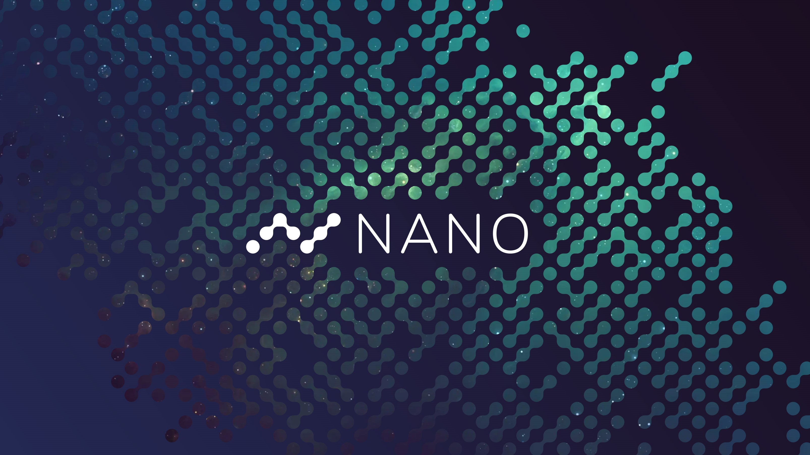

# Nano Stuffs

### [Nano](https://nano.org/) is decentralized, sustainable, and secure digital money focused on addressing the inefficiencies present in existing financial systems. 
 

  

 

## :scroll: What's over here?
**Personal documentation for understanding and building on **Nano** protocol.**

## :scroll: Quick Access

- [What is Nano](docs/what-is-nano.md)
- [Run a Node](docs/run-a-node.md)
- [Nano Basics](docs/nano-basics.md)

## :scroll: Stuffs you need to know
**We need to understand the following topics :** 

- Special features of Nano
- **Open Representative Voting** (Consensus Mechanism)
- Types of Nano nodes
- **Block Lattice** design
- Block specification and format
- Hardware Specs 
- Accounts, Keys, Seeds and Wallet IDs
- URI & QR Standard
 

## :star: How do I get started?

1. Check the [Nano Official Website](https://nano.org)
1. For having a quick taste of nano, have a conversation with [@thenanobot](https://thenanobot.com)
1. For getting started with mobile wallet, install [Natrium](https://natrium.io/) and create an account.

## :scroll: Credits

1. Awesome cover image by [@lucasols](https://www.reddit.com/user/lucasols)
2. Most of the information salvaged from [Nano Docs](https://docs.nano.org) (Go here for detailed documentation)

----
